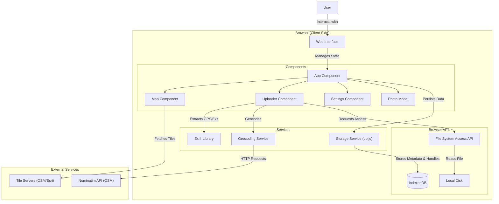

# System Architecture: Drone Photo GPS Visualizer

This document outlines the architecture of the Drone Photo GPS Visualizer application, detailing its components, data flow, and external interactions.

## High-Level Overview

The application is a client-side React web application that visualizes drone photos on an interactive map. It uses the **File System Access API** to reference local files without uploading them, ensuring data privacy and storage efficiency. Metadata (EXIF) is extracted locally and stored in **IndexedDB** for persistence.

## Data Flow

1.  **Import Process**:
    *   User selects files via `Uploader`.
    *   `File System Access API` grants a `FileSystemFileHandle`.
    *   `Exifr` parses the file for GPS, Altitude, and Camera data.
    *   `Geocoding Service` fetches location name from Nominatim.
    *   Photo metadata + File Handle are stored in `IndexedDB`.
    *   **Optimization**: The actual image file is *not* stored in DB, only the reference (Handle).

2.  **Visualization**:
    *   `App` loads metadata from `IndexedDB`.
    *   `Map` renders markers based on GPS coordinates.
    *   User clicks a marker -> `PhotoModal` opens.
    *   `PhotoModal` requests image file from `FileHandle`.
    *   **Permission Check**: If permission is lost (e.g., page reload), UI prompts user to re-verify.

3.  **Search & Filter**:
    *   Filtering happens client-side based on loaded metadata.
    *   Radius search uses `Geocoding Service` to convert search query to coordinates, then filters by distance (Haversine formula).

## Component Responsibilities

*   **App.jsx**: Main controller. Manages global state (photos, search, view mode).
*   **Map.jsx**: Wraps `react-leaflet`. Handles map rendering, layers, and markers.
*   **Uploader.jsx**: Handles file selection, EXIF extraction, and initial data processing.
*   **Settings.jsx**: List view of photos. Handles management (deletion).
*   **db.js**: Abstraction layer for `idb` (IndexedDB wrapper). Handles `FileSystemFileHandle` permissions and retrieval.
*   **geocoding.js**: Utilities for forward/reverse geocoding and distance calculations.
